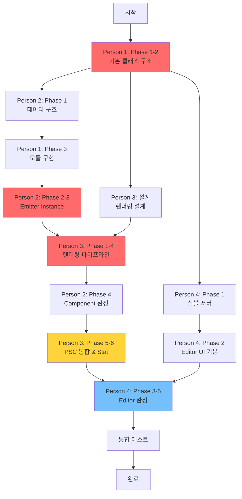

# Particle System 프로젝트 작업 분배 계획

## 📋 프로젝트 개요

**프로젝트명**: Unreal Engine 스타일 Particle System 구현
**개발 기간**: 1주일 (7일)
**팀 구성**: 4명
**목표**: Sprite/Mesh Emitter 지원, Editor 구현, Symbol Server 구축

---

## 👥 팀원별 역할 요약

| 팀원 | 담당 영역 | 우선순위 | 난이도 | 예상 기간 |
|------|----------|---------|--------|----------|
| **Person 1** | Engine Core - Particle System 기반 구조 | 🔴 최우선 | 높음 | 3-4일 |
| **Person 2** | Particle System Component & Data Management | 🔴 최우선 | 높음 | 3-4일 |
| **Person 3** | Rendering System (Sprite/Mesh Emitter) | 🟡 2순위 | 중상 | 3-4일 |
| **Person 4** | Editor & Tools (UI + Symbol Server) | 🟡 2순위 | 중 | 3-4일 |

---

## 📝 Person 1: Engine Core - Particle System 기반 구조

### 역할
모듈 시스템과 파티클 시스템의 핵심 아키텍처를 구축합니다. 모든 다른 작업의 기반이 되는 **최우선 크리티컬 패스**입니다.

### Phase 1: 기본 클래스 구조 (Day 1)

- [ ] `UObject` 기반 클래스 구조 설계
- [ ] `UParticleModule` 기본 클래스 구현
- [ ] `UParticleModuleRequired` 구현 (필수 모듈)
- [ ] `UParticleLODLevel` 클래스 구현
  - [ ] `Level`, `bEnabled` 속성
  - [ ] `RequiredModule`, `Modules` 배열, `TypeDataModule` 포인터

### Phase 2: Emitter & System (Day 1-2)

- [ ] `UParticleEmitter` 클래스 구현
  - [ ] `LODLevels` 배열 관리
  - [ ] `CacheEmitterModuleInfo()` 메서드 구현
  - [ ] `ParticleSize` 계산 로직
- [ ] `UParticleSystem` 클래스 구현
  - [ ] `Emitters` 배열 관리
  - [ ] 시스템 초기화 로직

### Phase 3: 파티클 모듈들 구현 (Day 2-3)

- [ ] `UParticleModuleSpawn` - 생성 빈도/수량 제어
- [ ] `UParticleModuleLifetime` - 수명 설정
- [ ] `UParticleModuleLocation` - 초기 위치
- [ ] `UParticleModuleVelocity` - 초기 속도/방향
- [ ] `UParticleModuleColor` - 색상 및 시간별 변화
- [ ] `UParticleModuleSize` - 크기 설정
- [ ] `UParticleModuleSizeScaleBySpeed` - 속도 기반 크기 조정

### Phase 4: Helper 시스템 (Day 3-4)

- [ ] `ParticleHelper.h` 매크로 구현
  - [ ] `DECLARE_PARTICLE_PTR` 매크로
  - [ ] `BEGIN_UPDATE_LOOP` 매크로
  - [ ] `END_UPDATE_LOOP` 매크로
- [ ] 모듈 Update 로직 테스트

### 의존성
- **선행 작업**: 없음 (최우선 작업)
- **이 작업 완료 시 해제되는 작업**: Person 2, 3, 4의 모든 작업

---

## 📝 Person 2: Particle System Component & Data Management

### 역할
파티클 데이터 구조와 메모리 관리를 담당하며, 실제 파티클의 생성/소멸 로직을 구현합니다.

### Phase 1: 파티클 데이터 구조 (Day 1)

- [ ] `FBaseParticle` 구조체 구현
  - [ ] `Location`, `Velocity`, `RelativeTime`, `Lifetime`
  - [ ] `BaseVelocity`, `Rotation`, `RotationRate`
  - [ ] `Size`, `Color` 속성
- [ ] `FParticleDataContainer` 구조체 구현
  - [ ] `MemBlockSize`, `ParticleDataNumBytes` 계산
  - [ ] `ParticleIndicesNumShorts` 관리
  - [ ] `ParticleData`, `ParticleIndices` 메모리 할당 로직
  - [ ] **Address Alignment** 최적화

### Phase 2: Emitter Instance (Day 1-2)

- [ ] `FParticleEmitterInstance` 구조체 구현
  - [ ] `SpriteTemplate`, `Component` 포인터
  - [ ] `CurrentLODLevelIndex`, `CurrentLODLevel`
  - [ ] `ParticleData`, `ParticleIndices`, `InstanceData` 포인터
  - [ ] `ParticleSize`, `ParticleStride` 계산
  - [ ] `ActiveParticles`, `MaxActiveParticles` 관리
  - [ ] `ParticleCounter` (모노토닉 증가)
- [ ] **[핵심]** `SpawnParticles()` 메서드 구현
  - [ ] `PreSpawn` 로직
  - [ ] `SpawnModules` 순회 및 적용
  - [ ] `PostSpawn` 로직
- [ ] **[핵심]** `KillParticle()` 메서드 구현

### Phase 3: Dynamic Emitter Data (Day 2-3)

- [ ] `FDynamicEmitterReplayDataBase` 구조체
  - [ ] `eEmitterType`, `ActiveParticleCount`
  - [ ] `ParticleStride`, `DataContainer`
  - [ ] `Scale`, `SortMode`
- [ ] `FDynamicSpriteEmitterReplayDataBase` 구현
  - [ ] `MaterialInterface`, `RequiredModule` 포인터
- [ ] `FDynamicEmitterDataBase` 추상 클래스
  - [ ] `EmitterIndex` 관리
  - [ ] `GetSource()` 순수 가상 함수

### Phase 4: Component 구현 (Day 3-4)

- [ ] `UParticleSystemComponent` 클래스 구현
  - [ ] `EmitterInstances` 배열 관리
  - [ ] `Template` (UParticleSystem) 포인터
  - [ ] `EmitterRenderData` 배열
- [ ] 메모리 정렬(Address Align) 최적화
- [ ] **Precache** 메커니즘 구현
- [ ] Component 업데이트 루프 최적화

### 의존성
- **선행 작업**: Person 1의 Phase 1-2 완료 필요
- **이 작업 완료 시 해제되는 작업**: Person 3의 Rendering Pipeline, Person 4의 Editor Preview

---

## 📝 Person 3: Rendering System

### 역할
Sprite/Mesh Emitter의 렌더링 파이프라인을 구현하고, 반투명 렌더링 및 정렬 처리를 담당합니다.

### Phase 1: 기본 렌더링 구조 (Day 2)

- [ ] `FDynamicSpriteEmitterDataBase` 클래스 구현
  - [ ] `SortSpriteParticles()` 메서드 (정렬 로직)
  - [ ] `GetDynamicVertexStride()` 순수 가상 함수
- [ ] `FDynamicSpriteEmitterData` 구현
  - [ ] `FParticleSpriteVertex` 정의
  - [ ] `GetDynamicVertexStride()` override (`sizeof` 반환)
- [ ] `FDynamicMeshEmitterData` 구현
  - [ ] `FMeshParticleInstanceVertex` 정의
  - [ ] `GetDynamicVertexStride()` override

### Phase 2: Sprite Emitter 렌더링 (Day 2-3)

- [ ] Dynamic Vertex Buffer 생성
  - [ ] `D3D11_USAGE_DYNAMIC` 플래그 설정
  - [ ] `D3D11_CPU_ACCESS_WRITE` 권한 설정
- [ ] Sprite 파티클 정점 데이터 생성
- [ ] Billboard 렌더링 로직 구현
- [ ] 텍스처/머티리얼 바인딩

### Phase 3: Mesh Emitter 렌더링 (Day 3-4)

- [ ] Mesh Instance 데이터 생성
- [ ] Instanced Rendering 파이프라인 구현
- [ ] Mesh 파티클 정점 데이터 변환

### Phase 4: 반투명 & 정렬 (Day 4)

- [ ] **Alpha Blend 구현**
  - [ ] Blend State 설정 (SrcAlpha, InvSrcAlpha)
  - [ ] Depth Write 비활성화
- [ ] **렌더링 순서(Order) 처리**
  - [ ] 카메라 거리 기반 정렬
  - [ ] 뒤에서 앞으로 렌더링 (Painter's Algorithm)
- [ ] SortMode별 정렬 로직 구현

### Phase 5: PSC 월드 통합 (Day 5)

- [ ] ParticleSystemComponent 월드 배치 시스템
- [ ] 월드 좌표 변환 적용
- [ ] 프레임 업데이트 연동

### Phase 6: 디버깅 & 최적화 (Day 5-6)

- [ ] **Show Flag 시스템** 구현
  - [ ] Particles, ParticleSprites, ParticleMeshes 플래그
- [ ] **Stat 시스템** 구현
  - [ ] 파티클 수, 드로우콜, 렌더링 시간 통계
- [ ] Vertex Buffer 업데이트 최적화
- [ ] Culling 로직 (뷰 프러스텀)

### 의존성
- **선행 작업**: Person 1의 Phase 1-3, Person 2의 Phase 1-3 완료 필요
- **이 작업 완료 시 해제되는 작업**: Person 4의 Editor Preview 렌더링

---

## 📝 Person 4: Editor & Tools

### 역할
파티클 시스템 에디터 UI와 심볼 서버 인프라를 구축합니다.

### Phase 1: 인프라 구축 (Day 1)

- [ ] **심볼 서버(Symbol Server) 구축**
  - [ ] `srctool.exe` 설치 및 설정
  - [ ] `pdbstr.exe` 설정
  - [ ] `symstore.exe` 구성
  - [ ] `\\192.168.xxx.yyy\\symbols` 네트워크 공유 폴더 생성
  - [ ] 팀원 접근 권한 설정
  - [ ] Visual Studio 디버거 연동
- [ ] 디버깅 환경 테스트

### Phase 2: Editor UI 기본 구조 (Day 2)

- [ ] Particle System Editor 윈도우 생성
- [ ] 메뉴 시스템 구현 (New, Open, Save)
- [ ] Emitter 목록 패널
- [ ] 속성(Property) 패널
- [ ] 레이아웃 관리

### Phase 3: Emitter 설정 UI (Day 3)

- [ ] **Sprite Emitter 지원**
  - [ ] Emitter 추가/삭제 UI
  - [ ] 머티리얼 선택 UI
  - [ ] Sprite 설정 패널
- [ ] **Mesh Emitter 지원**
  - [ ] Mesh 에셋 선택 UI
  - [ ] Mesh Emitter 속성 패널

### Phase 4: 모듈 시스템 UI (Day 3-4)

- [ ] 모듈 추가/삭제 UI
- [ ] 각 모듈별 속성 편집 패널
  - [ ] Spawn (빈도, 수량)
  - [ ] Lifetime (Min/Max)
  - [ ] Location (초기 위치, 분포)
  - [ ] Velocity (속도, 방향)
  - [ ] Color (초기 색, 시간별 변화)
  - [ ] Size (크기, 스케일)
- [ ] 모듈 순서 변경 기능 (Drag & Drop)

### Phase 5: 실시간 프리뷰 (Day 4-5)

- [ ] 뷰포트 통합
- [ ] 실시간 파티클 시뮬레이션
- [ ] 재생/정지/리셋 컨트롤
- [ ] 카메라 조작 (회전, 줌)
- [ ] 배경 그리드 표시

### Phase 6: 추가 기능 (Day 5-6)

- [ ] 파티클 시스템 저장/로드 (직렬화)
- [ ] 프리셋 시스템
- [ ] Undo/Redo 기능
- [ ] *(선택) 커브 에디터 (시간별 값 변화)*

### 의존성
- **선행 작업**: Person 1의 Phase 1-2, Person 2의 Phase 4, Person 3의 Phase 5 완료 필요
- **이 작업 완료 시 해제되는 작업**: 없음 (독립적)

---

## 🔗 작업 의존성 다이어그램



### 텍스트 기반 의존성 흐름

```
[시작]
   |
   v
[Person 1 - Phase 1-2] ← 🔴 최우선 크리티컬 패스
(기본 클래스 구조)
   |
   +------------------+------------------+
   |                  |                  |
   v                  v                  v
[Person 2 - Phase 1] [Person 3 - 설계] [Person 4 - Phase 1]
(데이터 구조)        (렌더링 설계)      (심볼 서버)
   |                  |                  |
   v                  |                  v
[Person 1 - Phase 3]  |          [Person 4 - Phase 2]
(모듈 구현)          |          (Editor UI 기본)
   |                  |                  |
   v                  |                  |
[Person 2 - Phase 2-3]|                  |
(Emitter Instance)   |                  |
   |                  |                  |
   +--------+---------+                  |
            |                            |
            v                            |
   [Person 3 - Phase 1-4] ← 🔴 크리티컬  |
   (렌더링 파이프라인)                   |
            |                            |
            v                            |
   [Person 2 - Phase 4]                  |
   (Component 완성)                      |
            |                            |
            v                            |
   [Person 3 - Phase 5-6]                |
   (PSC 통합 & Stat)                     |
            |                            |
            +---------------+------------+
                            |
                            v
                  [Person 4 - Phase 3-5]
                  (Editor 완성)
                            |
                            v
                     [통합 테스트]
                            |
                            v
                         [완료]
```

---

## 📅 일일 마일스톤

### Day 1 (월요일) - 기반 구축

| 팀원 | 목표 | 완료 조건 |
|------|------|----------|
| Person 1 | 기본 클래스 구조 완료 | `UParticleModule`, `UParticleLODLevel` 컴파일 성공 |
| Person 2 | 데이터 구조 완료 | `FBaseParticle`, `FParticleDataContainer` 구현 |
| Person 3 | 렌더링 설계 | 렌더링 파이프라인 설계 문서 작성 |
| Person 4 | 심볼 서버 구축 완료 | 모든 팀원이 디버깅 가능한 환경 확인 |

### Day 2 (화요일) - 코어 로직

| 팀원 | 목표 | 완료 조건 |
|------|------|----------|
| Person 1 | 모듈 시스템 50% 완료 | Spawn, Lifetime, Location 모듈 동작 |
| Person 2 | Emitter Instance 완료 | `SpawnParticles()`, `KillParticle()` 동작 |
| Person 3 | 렌더링 기본 구조 완료 | `FDynamicSpriteEmitterData` 구조 완성 |
| Person 4 | Editor UI 기본 구조 | 빈 윈도우 + 메뉴 시스템 동작 |

### Day 3 (수요일) - 1차 통합

| 팀원 | 목표 | 완료 조건 |
|------|------|----------|
| Person 1 | 모듈 시스템 100% 완료 | 모든 모듈 테스트 통과 |
| Person 2 | Dynamic Emitter Data 완료 | ReplayData 구조 완성 |
| Person 3 | Sprite Emitter 렌더링 완료 | 화면에 Sprite 파티클 표시 🎉 |
| Person 4 | Emitter 설정 UI 완료 | Sprite/Mesh Emitter 추가/삭제 가능 |

### Day 4 (목요일) - 기능 확장

| 팀원 | 목표 | 완료 조건 |
|------|------|----------|
| Person 1 | Helper 매크로 완성 | 모듈 개발자가 사용 가능한 API 제공 |
| Person 2 | Component 완성 | `UParticleSystemComponent` 동작 |
| Person 3 | Mesh Emitter + Alpha Blend | 반투명 Mesh 파티클 렌더링 |
| Person 4 | 모듈 UI 완료 | 모든 모듈 속성 편집 가능 |

### Day 5 (금요일) - 통합 테스트

| 팀원 | 목표 | 완료 조건 |
|------|------|----------|
| Person 1 | 코드 리뷰 & 버그 수정 | Critical 버그 0개 |
| Person 2 | 메모리 최적화 | Precache, Address Align 적용 |
| Person 3 | PSC 통합 + Show Flag/Stat | 월드에 배치 가능, 통계 표시 |
| Person 4 | 실시간 프리뷰 완료 | Editor에서 파티클 확인 가능 |
| **전체** | **1차 통합 테스트** | **End-to-End 시나리오 동작** |

### Day 6 (토요일) - 최적화 & 개선

| 팀원 | 목표 | 완료 조건 |
|------|------|----------|
| Person 1-2 | 성능 프로파일링 | 병목 구간 개선 |
| Person 3 | 렌더링 최적화 | FPS 안정화, Culling 적용 |
| Person 4 | 추가 기능 & UX 개선 | Undo/Redo, 프리셋 시스템 |
| **전체** | **버그 수정** | **알려진 버그 모두 해결** |

### Day 7 (일요일) - 최종 마무리

| 팀원 | 목표 | 완료 조건 |
|------|------|----------|
| **전체** | 최종 통합 테스트 | 모든 필수 기능 동작 |
| **전체** | 문서화 | README, 사용 가이드 작성 |
| **전체** | (선택) LOD, Collision 검토 | 시간 여유 시 추가 기능 구현 |

---

## 🎯 크리티컬 패스 (Critical Path)

가장 시간이 오래 걸리고 다른 작업을 블로킹하는 순서:

### 순서도

```
1. Person 1 - Phase 1-2 (Day 1)
   ↓ [모든 작업의 기반]

2. Person 1 - Phase 3 (Day 2-3)
   ↓ [모듈 시스템]

3. Person 2 - Phase 1-3 (Day 1-3)
   ↓ [데이터 관리]

4. Person 3 - Phase 1-4 (Day 2-4)
   ↓ [렌더링 파이프라인] ← 🔴 가장 긴 크리티컬 패스

5. Person 3 - Phase 5-6 (Day 5)
   ↓ [PSC 통합]

6. Person 4 - Phase 3-5 (Day 3-5)
   ↓ [Editor 완성]

7. 통합 테스트 (Day 5-7)
```

### 크리티컬 패스 상 주의사항

1. **Person 1의 지연 → 전체 프로젝트 지연**
   - 가장 경험 많은 개발자 배치 권장
   - 인터페이스 우선 설계로 병렬 작업 가능하도록

2. **Person 3의 렌더링 파이프라인 → 2번째 크리티컬**
   - 디버깅 시간을 충분히 확보
   - Show Flag로 단계별 테스트 가능하도록

3. **Person 2의 SpawnParticles() → 복잡도 높음**
   - Person 1의 Helper 매크로 우선 지원 필요

---

## ⚠️ 리스크 관리

### 🔴 높은 리스크 작업

#### 1. Person 2 - `SpawnParticles()` 로직
**리스크**: 복잡도가 높아 지연 가능성
**영향도**: Person 3 렌더링 작업 블로킹
**대응 방안**:
- Person 1이 Helper 매크로(`DECLARE_PARTICLE_PTR`, `BEGIN/END_UPDATE_LOOP`)를 우선 완성
- Mock 데이터로 먼저 구조 검증
- 단위 테스트 작성

#### 2. Person 3 - Alpha Blend & 렌더링 순서
**리스크**: 디버깅 시간 소요 가능
**영향도**: PSC 통합 및 Editor 프리뷰 지연
**대응 방안**:
- Show Flag로 단계별 디버깅 (Opaque → Translucent 순차 테스트)
- RenderDoc/PIX 같은 그래픽 디버거 사용
- 정렬 알고리즘 먼저 검증 (단위 테스트)

#### 3. Person 4 - Editor 통합
**리스크**: 다른 팀원의 작업 지연 시 영향
**영향도**: 프로젝트 최종 완성도
**대응 방안**:
- Mock 데이터로 UI 먼저 개발
- Stub 함수로 인터페이스 테스트
- 렌더링 없이 데이터 편집 기능부터 완성

### 🟡 중간 리스크

#### 4. 메모리 관리 (Address Align, Precache)
**리스크**: 최적화 누락 시 성능 저하
**대응 방안**:
- Day 5에 전용 최적화 시간 확보
- 프로파일러로 측정 후 적용

#### 5. LOD/Collision 선택 기능
**리스크**: 필수 기능 완성 전 시간 소모
**대응 방안**:
- Day 7까지 손대지 않기
- 필수 기능 100% 완성 후에만 시도

---

## 🔄 의존성 관리 전략

### 1. Daily Sync (매일 오전 30분)
- **시간**: 오전 9:00 - 9:30
- **내용**:
  - 전날 완료 항목 확인
  - 오늘 목표 공유
  - 블로킹 이슈 논의
  - 인터페이스 변경 사항 공유

### 2. Interface First 접근
- **Person 1**: 헤더 파일(`.h`) 먼저 작성하여 다른 팀원이 병렬 작업 가능
- **예시**:
  ```cpp
  // Day 1 오전: Person 1이 먼저 작성
  class UParticleModule : public UObject
  {
  public:
      virtual void Update(FParticleEmitterInstance* Owner, int32 Offset, float DeltaTime) = 0;
  };

  // Day 1 오후: Person 2가 이미 사용 가능
  void FParticleEmitterInstance::SpawnParticles(...)
  {
      for (auto* Module : Modules)
      {
          Module->Update(this, ...); // 인터페이스 사용
      }
  }
  ```

### 3. Stub 구현
- 의존 작업 대기 시 Stub 함수로 임시 구현
- **예시**:
  ```cpp
  // Person 3이 Person 2 대기 중일 때
  void FParticleEmitterInstance::SpawnParticles(...)
  {
      // TODO: Person 2 구현 대기
      // Stub: 테스트용 더미 파티클 생성
      ActiveParticles = 10;
  }
  ```

### 4. 통합 타이밍
- **Day 3 (수요일)**: 1차 통합 (Sprite Emitter 렌더링 확인)
- **Day 5 (금요일)**: 2차 통합 (전체 시스템 End-to-End)
- **Day 7 (일요일)**: 최종 통합 테스트

---

## 📚 핵심 키워드 정리

### 아키텍처
- **Module**: 파티클 속성을 제어하는 독립적인 컴포넌트
- **Cascade**: Unreal Engine의 파티클 에디터 이름
- **LOD (Level of Detail)**: 거리에 따른 파티클 품질 조절
- **Payload**: 파티클 인스턴스별 추가 데이터
- **Instance**: 실제 실행 중인 파티클 Emitter

### 파티클 속성
- **Velocity**: 파티클의 속도 벡터
- **Lifetime**: 파티클의 수명
- **Initial Size**: 파티클의 초기 크기
- **Spawn/Kill**: 파티클 생성/소멸

### 렌더링
- **Sprite Emitter**: 2D 빌보드 파티클
- **Mesh Emitter**: 3D 메시 파티클
- **Blend State**: 반투명 렌더링 상태
- **Dynamic Vertex Buffer**: 매 프레임 갱신되는 버텍스 버퍼
  - `D3D11_USAGE_DYNAMIC`
  - `D3D11_CPU_ACCESS_WRITE`
- **ReplayData**: 렌더링에 필요한 파티클 데이터 스냅샷

### 데이터 구조
- **Source/Destination**: 파티클 데이터의 읽기/쓰기 버퍼
- **Precache**: 사전 캐싱으로 런타임 성능 향상
- **Address Align**: 메모리 정렬 최적화

---

## 🎓 선택 학습 (Optional Features)

시간 여유가 있을 경우 다음 기능 구현 고려:

### 1. Particle System LOD 렌더링
- 거리에 따른 파티클 개수/품질 조절
- 성능 최적화에 효과적

### 2. Particle Collision
- 다른 Component와의 충돌 처리 이벤트
- 관련 클래스:
  - `UParticleModuleCollision`
  - `AParticleEventManager`
  - `UParticleModuleEventGenerator`
  - `FParticleEventCollideData`

### 3. Beam Emitter
- 레이저/번개 같은 빔 효과

### 4. Ribbon Emitter
- 궤적(Trail) 효과

### 5. 커브 에디터
- 시간에 따른 파라미터 변화를 곡선으로 편집

---

## 🛠️ 개발 환경

### 필수 도구
- **Visual Studio 2019/2022**: C++ 개발
- **Symbol Server**: 디버깅 인프라
  - `srctool.exe`
  - `pdbstr.exe`
  - `symstore.exe`
- **네트워크 공유**: `\\192.168.xxx.yyy\\symbols`

### 권장 도구
- **RenderDoc / PIX**: 그래픽 디버깅
- **Very Sleepy / Visual Studio Profiler**: 성능 프로파일링
- **Git**: 버전 관리

---

## 📞 커뮤니케이션 규칙

### 코드 변경 시
1. **인터페이스 변경**: 즉시 팀 전체에 공지
2. **빌드 브레이크**: 30분 내 수정 또는 롤백
3. **머지 전**: 로컬 빌드 + 기본 테스트 통과 확인

### 블로킹 이슈 발생 시
1. 즉시 Slack/Discord에 공유
2. Daily Sync 대기하지 말고 바로 논의
3. 우회 방안 찾기 (Stub, Mock)

### 코드 리뷰
- Person 1-2: 서로 코드 리뷰
- Person 3-4: 서로 코드 리뷰
- 크리티컬 패스 코드는 전체 리뷰

---

## ✅ 최종 체크리스트

### 필수 기능
- [ ] Sprite Emitter 렌더링
- [ ] Mesh Emitter 렌더링
- [ ] 모든 필수 모듈 동작 (Spawn, Lifetime, Location, Velocity, Color, Size)
- [ ] Alpha Blend 반투명 렌더링
- [ ] 렌더링 순서 정렬
- [ ] Particle System Editor
- [ ] Show Flag 시스템
- [ ] Stat 시스템
- [ ] Symbol Server 구축

### 선택 기능
- [ ] LOD 시스템
- [ ] Collision 시스템
- [ ] Beam Emitter
- [ ] Ribbon Emitter
- [ ] 커브 에디터

---

## 📄 참고 자료

### Unreal Engine 문서
- [Cascade Particle Editor](https://docs.unrealengine.com/4.27/en-US/RenderingAndGraphics/ParticleSystems/Cascade/)
- [Particle System Reference](https://docs.unrealengine.com/4.27/en-US/RenderingAndGraphics/ParticleSystems/Reference/)

### 렌더링
- [Alpha Blending Techniques](https://learnopengl.com/Advanced-OpenGL/Blending)
- [Painter's Algorithm](https://en.wikipedia.org/wiki/Painter%27s_algorithm)

### 디버깅
- [Symbol Server Setup](https://docs.microsoft.com/en-us/windows-hardware/drivers/debugger/symbol-stores-and-symbol-servers)

---

**문서 작성일**: 2025-11-21
**프로젝트 기간**: 1주일 (7일)
**최종 수정**: 초안

